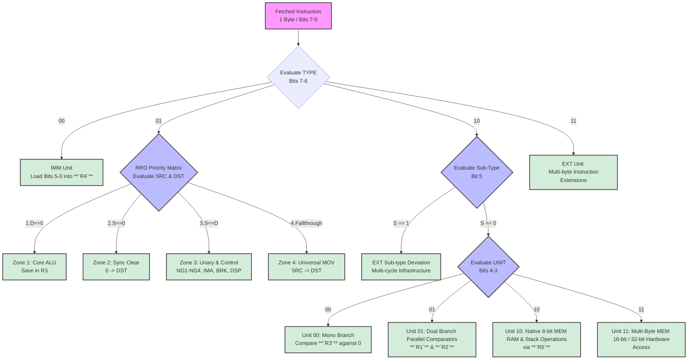

# Hardware Decoding Tree of the Allen-8 ISA

This document provides a structural visualization of the hardware decoding logic. The instruction decoder evaluates the 8-bit instruction opcode sequentially, branching through hardware routing gates to activate the correct execution units.

---